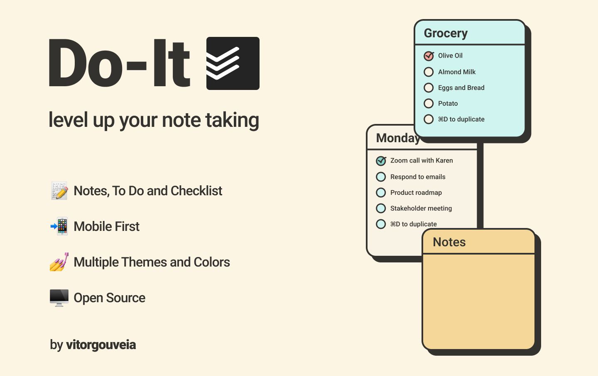

<h1 align="center">
  Do-It
   
</h1>

<div align="center">
  
  
</div>



> Do-It is a Todo App to organize your tasks.

<sub>
  based on: <a href="https://www.figma.com/community/file/873811480190908553">Noted</a>,
  <a href="https://www.figma.com/community/file/878163781510970757">Noteqor</a> and
  <a href="https://www.figma.com/community/file/846385918388040137">Todoist</a>
</sub>

---

### 🛠️ Adjusts and Updates

The project is still in development and the next updates will be:

- [ ] Tema Escuro
- [ ] Landing Page
- [ ] About Page
- [ ] Account System
- [ ] Pass it to next.js

## 🚀 Installing Do-It

to install Do-It, follow this steps:

- clone the <a href="https://github.com/VitorGouveia/do-it/">repository</a>:

  ```bash
    git clone https://github.com/VitorGouveia/do-it.git
  ```
  
- install the dependencies:
  ```bash
    yarn
    
    # OR
    
    npm i
  ```

## 📫 Contributing to Do-It
  Before contributing, check if you attend the requirements:
* Have the most recent version of `node`
* Went through the <a href="https://www.figma.com/file/LJRQ46Y8dxLiqMBOJUDHGB/Do-It?node-id=3%3A200">Design System</a>

1. Fork this repository.
2. Create a branch with the name of your feature/bug fix.
3. Commit your changes.
4. Merge the new branch into the main branch.
5. Make a pull request.

## 🤝 Colaborators

I thank everybody that colaborated to this project:

<table>
  <tr>
    <td align="center">
      <a href="#">
        <br>
        <sub>
          <b>AtomicFeasT</b>
        </sub>
      </a>
    </td>
  </tr>
</table>

## 📝 License

This project is under the MIT license. See the [license](LICENSE.md) file for mode details.

[⬆ Go to the top](#do-it)<br>